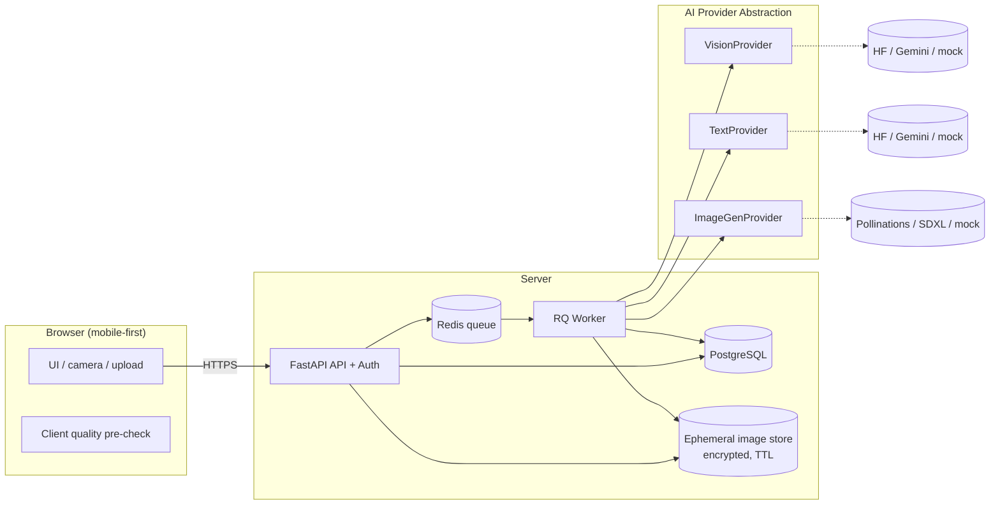
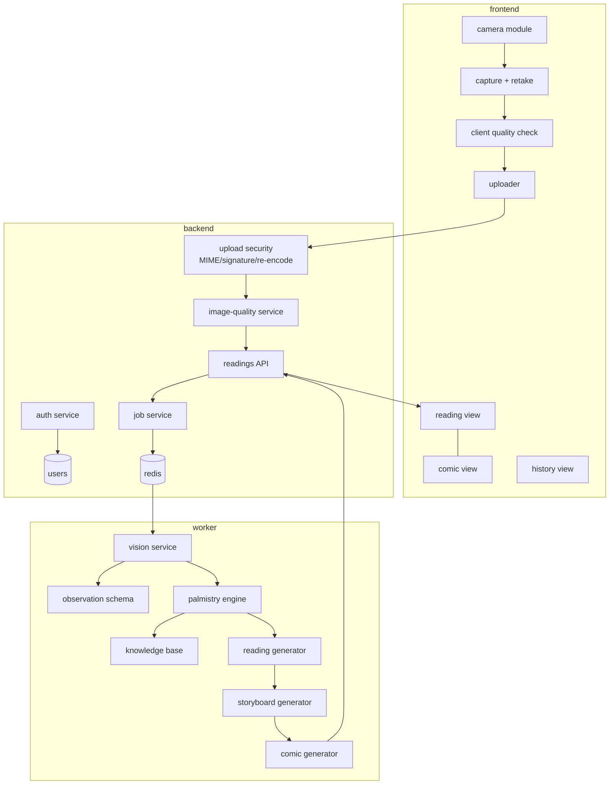
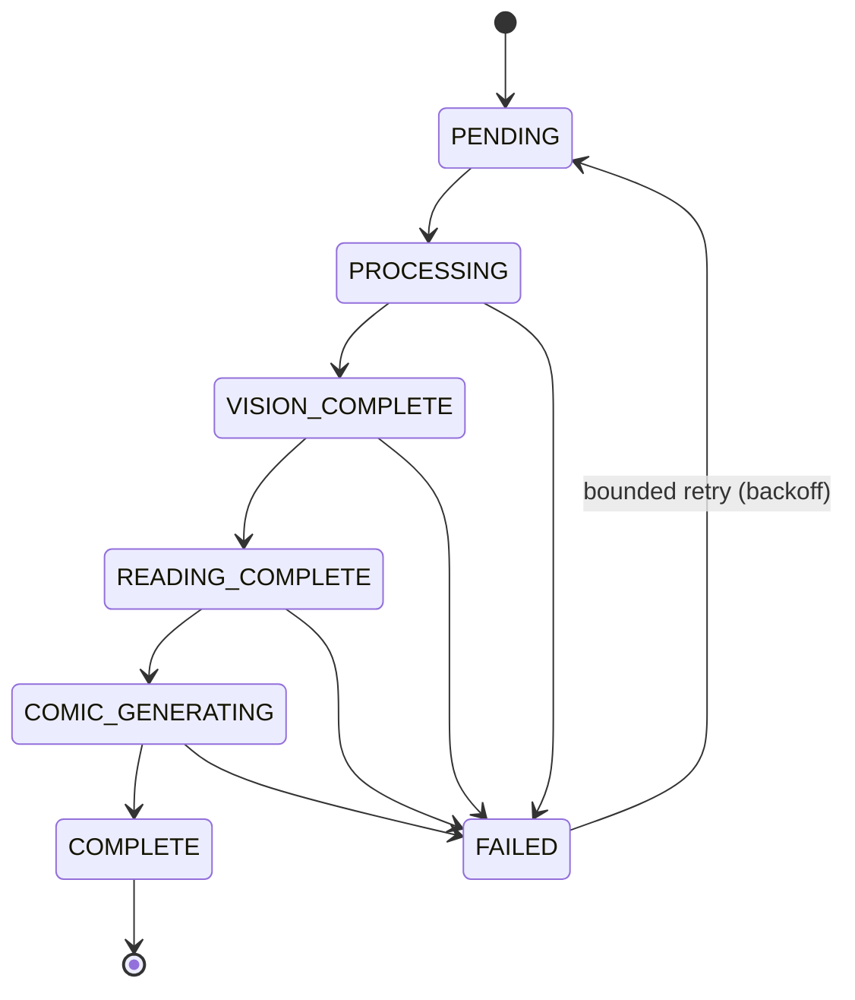

# PalmStory AI — Architecture (Phase 0)

> *Your palm. Your story. Reimagined by AI.*
>
> **Positioning:** PalmStory AI is an **entertainment** product. Palmistry is a
> cultural/traditional practice, **not** a scientifically validated method of
> prediction. Nothing here is medical, financial, legal, or psychological advice.
> All readings are AI-generated, fictionalized storytelling based on visible
> image features.

This document is the Phase 0 deliverable required by the spec (Section 57). It
defines *what we will build and how*, and stops before any Phase 1 code, pending
your approval.

---

## 0. Relationship to the existing prototype ("Palmoji") — gap analysis

We already built a lightweight prototype (a single-file front-end + a few
serverless functions). PalmStory AI is a **re-architecture**, not an edit of that
file. Here is an honest map of the spec against what exists today.

| Spec area | Prototype status | Plan |
|---|---|---|
| Camera capture + upload fallback | ✅ present (client-only) | Rebuild in Phase 3 with guide overlay + validation |
| Palm guide overlay | ⚠️ basic dashed outline | Improve in Phase 3 |
| Image **quality checks** (blur/brightness/etc.) | ❌ none | Phase 4 (client pre-check + server authoritative) |
| **Computer vision** (OpenCV / MediaPipe landmarks) | ❌ none | Phase 4 |
| Vision model → **structured observations** | ⚠️ freeform reading | Phase 6 (schema-validated JSON) |
| **Palmistry interpretation engine** (rules layer) | ❌ none (LLM did it all) | Phase 7 |
| Traditional palmistry **knowledge base** | ⚠️ inline prompt only | Phase 7 (structured data) |
| LLM narrative reading | ✅ present | Phase 8 (from structured input) |
| Comic **storyboard → validated JSON → image** | ⚠️ ad-hoc panels | Phase 9–10 (schema + panels) |
| **Provider abstraction** (Vision/Text/Image) | ❌ hard-coded HF/Pollinations | Phase 5 |
| **Mock providers** for dev/CI | ❌ none | Phase 5 |
| **Async job queue** + states | ❌ synchronous | Phase 11 |
| Real **authentication** (register/login/hashing) | ❌ session-id only, no password | Phase 2 |
| Per-user **isolation** of readings | ⚠️ session-scoped, not enforced | Phase 2 |
| Reading **history / detail / delete / export** | ⚠️ partial (IndexedDB) | Phase 12 |
| **Privacy**: don't store raw palm image by default | ❌ stored as data URL | Phase 13 (delete-after-process default) |
| **Delete account / export data** | ❌ none | Phase 12–13 |
| **Image security** (MIME/signature/re-encode) | ❌ none | Phase 13 |
| **AI output validation** against schemas | ❌ none | Phase 5–6 |
| **Rate limiting** | ❌ none | Phase 13 |
| Security headers / CSRF | ❌ none | Phase 13 |
| **Tests** (unit/integration/e2e) | ❌ none | Phase 14 |
| **CI** (GitHub Actions, no external AI) | ❌ none | Phase 16 |
| **Docker** dev environment | ❌ none | Phase 17 |
| **Docs** (architecture/pipeline/privacy/security/api) | ⚠️ README only | throughout + Phase 19 |
| Payments / bookings / shop | ✅ present (out of PalmStory scope) | *Not part of this spec — kept separate* |

**Summary:** the prototype proves the *idea* (capture → reading → comic). It does
**not** satisfy the spec's engineering requirements (real auth, CV, provider
abstraction, jobs, schema validation, privacy-by-default, security, tests, CI,
Docker, docs). PalmStory AI builds those properly.

> Note: the prototype's **payments, bookings, and book shop are out of scope** for
> the PalmStory AI spec. They stay in the separate Palmoji project unless you say
> otherwise.

---

## 1. Product requirements

### Functional
1. Register / log in / log out; each user has a **private** reading history.
2. Choose left/right palm; open camera (rear on mobile) or upload an image.
3. Guided capture with an on-screen palm outline + lighting/positioning hints.
4. Local + server **image-quality gate** before any paid AI call.
5. Pipeline: quality → palm detection → vision observations → interpretation →
   narrative reading → comic storyboard → comic image.
6. Reading result contains: snapshot, major lines, traditional interpretation,
   personality / career / relationship themes, strengths, challenges, "palm
   story" summary, and a comic strip.
7. History: list, open, delete one, delete all, export, delete account.

### Non-functional
- Responsive (mobile-first camera), accessible (WCAG-minded), reduced-motion.
- Provider-agnostic AI; graceful degradation (e.g. SVG comic fallback).
- Privacy-by-default (don't persist raw palm images unless consented).
- Secure (auth, uploads, rate limits, headers, secret management).
- Testable without spending AI credits (mock providers; CI never calls real AI).
- Observable (request IDs, durations, provider/model, job status) **without**
  logging images, secrets, or private content.

### Explicitly out of scope / prohibited
- No deterministic future predictions; no medical/financial/legal claims.
- No "your palm proves…" language; always "traditional palmistry interprets…".
- No training on user images; no selling/sharing images; no images in logs.
- No fake precision ("87.42% chance"). Detection confidence ≠ interpretation.

---

## 2. System architecture

**Stack (chosen, with rationale):**

| Concern | Choice | Why |
|---|---|---|
| Backend/API | **FastAPI (Python)** | Async, first-class **Pydantic** schemas (matches the "validate all AI output" requirement), auto OpenAPI docs, great CV/AI ecosystem |
| Data | **PostgreSQL + SQLAlchemy + Alembic** | Relational models, migrations |
| Queue/worker | **Redis + RQ** (Celery is the heavier alt) | Async jobs, retries, simple ops |
| CV | **OpenCV + MediaPipe Hands** | Local, free landmark detection + quality checks |
| Frontend | **Jinja templates + TypeScript modules (Vite)**; Tailwind or hand-rolled tokens | Polished, progressive-enhancement; React is a viable alt if you prefer an SPA |
| Auth | **Server sessions + secure cookies**, Argon2 password hashing, CSRF tokens | Simple, safe for a template app |
| Deploy | **Docker Compose** (web, worker, db, redis) → Fly.io/Render/VPS | Reproducible; the whole thing runs with one command |



---

## 3. Component diagram



---

## 4. Database schema

```mermaid
erDiagram
  USER ||--o{ READING : owns
  READING ||--o{ READING_OBSERVATION : has
  READING ||--|| READING_INTERPRETATION : has
  READING ||--o| COMIC_STORYBOARD : has
  COMIC_STORYBOARD ||--o| COMIC_IMAGE : renders
  READING ||--|| AI_JOB : processed_by
  USER ||--o{ AUDIT_EVENT : generates
  AI_JOB ||--o{ PROVIDER_USAGE : records

  USER { uuid id PK; text email UK; text password_hash; timestamptz created_at; bool image_retention_consent }
  READING { uuid id PK; uuid user_id FK; text hand; text status; text summary; timestamptz created_at; bool image_stored }
  READING_OBSERVATION { uuid id PK; uuid reading_id FK; text feature; text observation; float detect_confidence }
  READING_INTERPRETATION { uuid id PK; uuid reading_id FK; jsonb reading_json }
  COMIC_STORYBOARD { uuid id PK; uuid reading_id FK; jsonb storyboard_json }
  COMIC_IMAGE { uuid id PK; uuid storyboard_id FK; text url_or_ref; text provider; text style }
  AI_JOB { uuid id PK; uuid reading_id FK; text state; int retry_count; text last_error; timestamptz updated_at }
  PROVIDER_USAGE { uuid id PK; uuid job_id FK; text provider; text model; int tokens; int latency_ms; bool success }
  AUDIT_EVENT { uuid id PK; uuid user_id FK; text action; jsonb meta; timestamptz created_at }
```

Design notes: raw palm image is **not** a column — it lives in an ephemeral,
encrypted store with a TTL and is deleted after processing unless the user
consents to retention (`image_stored` flag records the choice). `detect_confidence`
is strictly *visual detection* confidence, never interpretation truth.

---

## 5. AI pipeline

```
image → quality gate → palm detection (CV) → vision model (observations, JSON)
      → palmistry interpretation engine (rules + knowledge base)
      → text model (narrative reading, JSON)
      → storyboard generator (panels, JSON)
      → image-generation model (comic) → result
```

Contracts between stages are **schemas**, not prose:
- `PalmObservationSchema` — what the vision model saw (feature, observation,
  `detect_confidence`). Observation ≠ interpretation, enforced by schema.
- `ReadingSchema` — the structured narrative sections.
- `ComicStoryboardSchema` — `{ title, panels[{panel, scene, visual, caption}] }`.
Any model output failing its schema is **rejected/retried**, never force-parsed.

Full stage-by-stage explanation will live in `docs/ai-pipeline.md` (Phase 19).

---

## 6. Computer vision pipeline

```
captured image
  → decode + safe re-encode (strip metadata, normalize)
  → quality assessment (brightness, blur/Laplacian variance, resolution, coverage)
  → MediaPipe Hands landmarks (palm present? orientation? fingers separated?)
  → crop/normalize to palm region; optional background reduction
  → hand-side sanity check vs user's left/right selection
  → pass normalized crop + landmark summary to the vision provider
```

If quality fails, the user gets actionable feedback ("move into better light",
"hold your palm flatter") **before** any paid AI call is made.

---

## 7. Provider abstraction

Three interfaces, selected by env config, each with a **mock** implementation:

```python
class VisionProvider(Protocol):
    async def observe(self, image: bytes, hand: str) -> PalmObservation: ...
class TextProvider(Protocol):
    async def write_reading(self, interp: Interpretation) -> Reading: ...
class ImageGenerationProvider(Protocol):
    async def render(self, storyboard: Storyboard, style: str) -> ComicImage: ...
```

```
VISION_PROVIDER=huggingface|gemini|mock
TEXT_PROVIDER=huggingface|gemini|mock
IMAGE_PROVIDER=pollinations|hf_sdxl|svg_fallback|mock
```

Rules: no hard-coded keys; graceful quota/rate-limit handling; bounded retries
with backoff; **configured** fallback only (never auto-escalate to a pricey
provider). CI and tests use the mock providers exclusively.

---

## 8. Privacy architecture

Palm images are treated as **sensitive, biometric-like** data.

- **Default: do not persist the raw image.** Process from an encrypted temp store
  with a short TTL, then delete. Persist only the reading + comic.
- **Retention is opt-in** (`image_retention_consent`), reversible, and deletable.
- Never train on user images; never sell/share; never log images or put them in
  error reports; signed/short-lived URLs only if ever served.
- **User data controls:** view history, delete a reading, delete all, export
  (JSON), delete account (cascades and removes any stored images).
- A clear, one-time privacy explanation + a persistent tasteful disclaimer.
- Details in `docs/privacy.md` (Phase 13/19).

---

## 9. Security model

- **Auth:** Argon2id hashing, secure/HTTPOnly/SameSite session cookies, CSRF
  tokens on state-changing forms, login/registration rate limits.
- **Authorization:** every reading access checks `reading.user_id == current_user`.
- **Uploads (untrusted):** validate MIME + extension + magic-byte signature +
  size + dimensions; **re-encode** via Pillow before downstream use; safe
  filenames; no path traversal; never execute uploaded content.
- **AI security:** validate every model response against a schema; treat image
  content as a possible prompt-injection vector; never let model output write to
  the DB or run code without validation.
- **Transport/headers:** HTTPS, HSTS, CSP, X-Content-Type-Options, etc.
- **Secrets:** env/secret manager only; never in the repo or client; `.env.example`
  documents names, not values.
- Details in `docs/security.md` (Phase 13/19).

---

## 10. Job / queue architecture



Jobs are **idempotent** (safe to retry), have bounded retries with backoff, a
timeout watchdog so nothing is stuck in `PROCESSING`, and a graceful comic
fallback (SVG/HTML) so a reading still completes if image-gen fails.

---

## 11. API design (v1)

```
POST   /api/v1/auth/register
POST   /api/v1/auth/login
POST   /api/v1/auth/logout
POST   /api/v1/image-quality-check      # cheap pre-check, no AI spend
POST   /api/v1/readings                 # create reading job (returns job id)
GET    /api/v1/readings                 # my history
GET    /api/v1/readings/{id}            # detail (owner only)
GET    /api/v1/readings/{id}/status     # poll job state
DELETE /api/v1/readings/{id}
POST   /api/v1/readings/{id}/regenerate
POST   /api/v1/comic/{id}/generate
GET    /api/v1/me/export                # export my data
DELETE /api/v1/me                       # delete account + data
```

All reading routes require auth + ownership checks. Requests/responses are typed
Pydantic models; errors are structured (never raw stack traces). Full reference
in `docs/api.md` (Phase 19).

---

## 12. Repository structure

```
palmstory/
├── backend/app/{api,auth,models,services,providers,schemas,jobs}/  + tests/
├── frontend/{templates,src/{camera,readings,comic,components},styles}/
├── vision/{preprocessing,palm_detection,quality}/
├── palmistry/{knowledge,interpretation,schemas}/
├── docs/{architecture.md,ai-pipeline.md,privacy.md,security.md,api.md,development.md}
├── tests/         scripts/        .github/workflows/
├── .env.example  .gitignore  Dockerfile  docker-compose.yml  README.md
```

(Mirrors the spec's Section 52; adjusted only where it improves cohesion.)

---

## 13. Development roadmap

| Phase | Deliverable | Gate |
|---|---|---|
| **0** | This architecture doc | **← you approve before Phase 1** |
| 1 | UI foundation (all screens, mock data, design system) | polished, no AI |
| 2 | Auth + user isolation | |
| 3 | Camera + upload + guide + client validation | |
| 4 | CV: preprocess, quality, MediaPipe detection, normalize | |
| 5 | Provider abstraction + **mock** providers, then 1 real | |
| 6 | Vision → validated observation JSON | |
| 7 | Palmistry knowledge base + interpretation engine | |
| 8 | LLM narrative reading from structured input | |
| 9 | Comic storyboard (validated JSON) | |
| 10 | Comic image generation + SVG fallback | |
| 11 | Async pipeline (queue, states, retries) | |
| 12 | History, detail, delete, export | |
| 13 | Privacy + security hardening pass | |
| 14 | Unit + integration + e2e tests (mock AI) | |
| 15 | Performance pass | |
| 16 | CI (GitHub Actions, no external AI) | |
| 17 | Docker dev env | |
| 18 | Final UX pass | |
| 19 | Docs + release prep | |

Commits are small and conventional (`feat:`, `test:`, `security:`, `docs:`), never
one giant final commit.

---

## 14. Key technical risks

1. **Palm detection reliability** across lighting/skin tones/orientations →
   mitigate with MediaPipe + quality gate + graceful "couldn't read your palm,
   retake" path; never overclaim accuracy.
2. **Free AI tiers change / rate-limit** → provider abstraction + backoff +
   configured fallback + SVG comic fallback; **verify terms before relying**.
3. **Prompt injection via image/EXIF** → strip metadata, re-encode, schema-validate
   all model output, treat image text as untrusted.
4. **Vision model conflates observation with interpretation** → separate schemas
   and a rules layer between them.
5. **Privacy/biometric sensitivity** → don't persist images by default; consent +
   deletion; never log/sell/train.
6. **Cost blow-ups from a UI bug re-sending images** → dedupe, job limits, user
   rate limits, quality gate before spend.
7. **Jobs stuck in PROCESSING** → timeout watchdog + idempotent retries.

---

## 15. Recommended free / open-source model strategy

> ⚠️ **Verify current terms before relying on any of these — free tiers and model
> availability change.** This is a starting strategy, not a guarantee.

- **Vision (observations):** an open VLM via Hugging Face Inference (e.g.
  `Llama-3.2-11B-Vision-Instruct` or a Qw2-VL family model). As of prototype work
  HF's router offered a small free tier; re-check quota.
- **Text (reading + storyboard):** an open instruct model (Llama/Mistral family)
  via HF; local Ollama as a zero-cost dev option.
- **Image (comic):** **Pollinations.ai** (key-less, free tier, rate-limited) as
  the easy default; SDXL/FLUX via HF as an alt; **SVG/HTML comic** as the always-
  available fallback.
- **CV:** OpenCV + MediaPipe — fully local, no per-call cost.
- **Dev/CI:** **mock providers** return deterministic fixtures so the whole app is
  testable with **zero** AI spend and CI never calls external AI.

Everything sits behind the provider interfaces, so swapping HF → Gemini/OpenAI/
local is a config change, not a rewrite.

---

## Phase 0 exit

This satisfies the 15 Phase-0 artifacts in Section 57. **Per your spec, I'm
stopping here for your approval before Phase 1 (UI foundation).**

When you approve, tell me:
1. **Stack confirmation** — FastAPI + Jinja/TS as above, or do you want a
   different frontend (e.g. React SPA) or backend?
2. **Fresh start vs. reuse** — begin the `palmstory/` repo clean (recommended, given
   how different it is), or port pieces of the Palmoji prototype where useful?
3. Any changes to the roadmap ordering or priorities.
